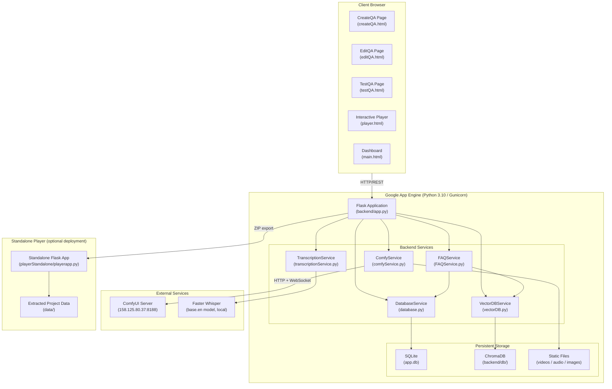
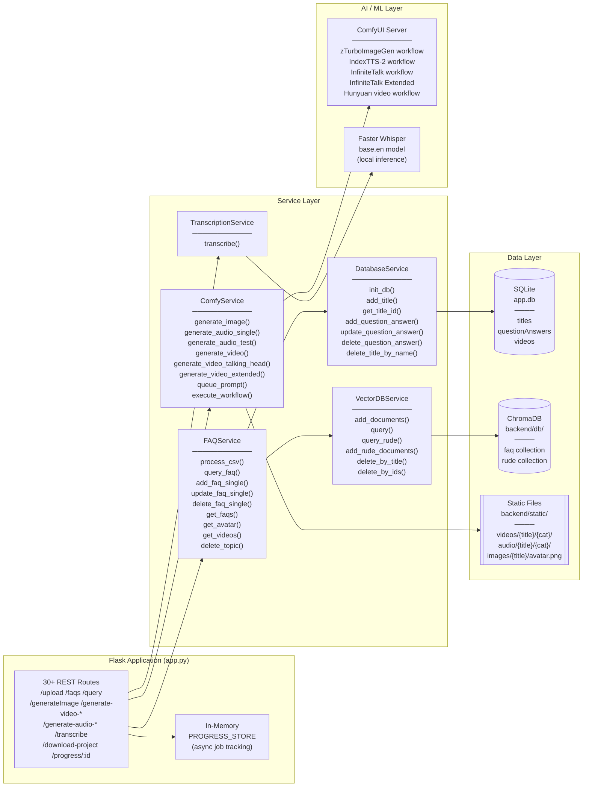
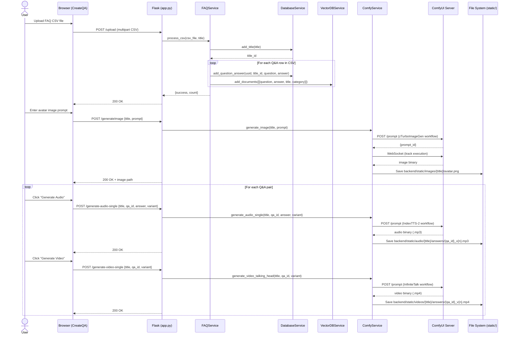
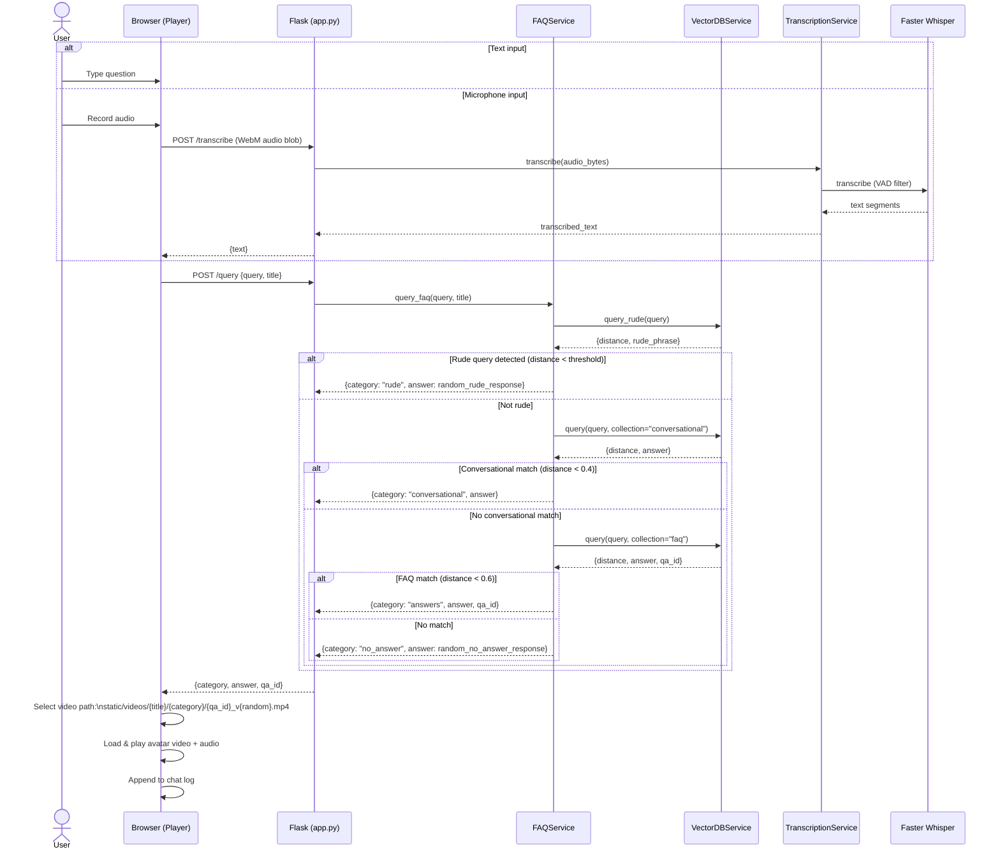
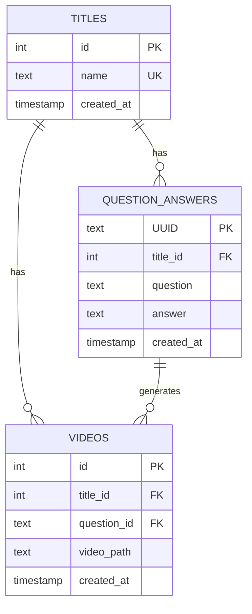
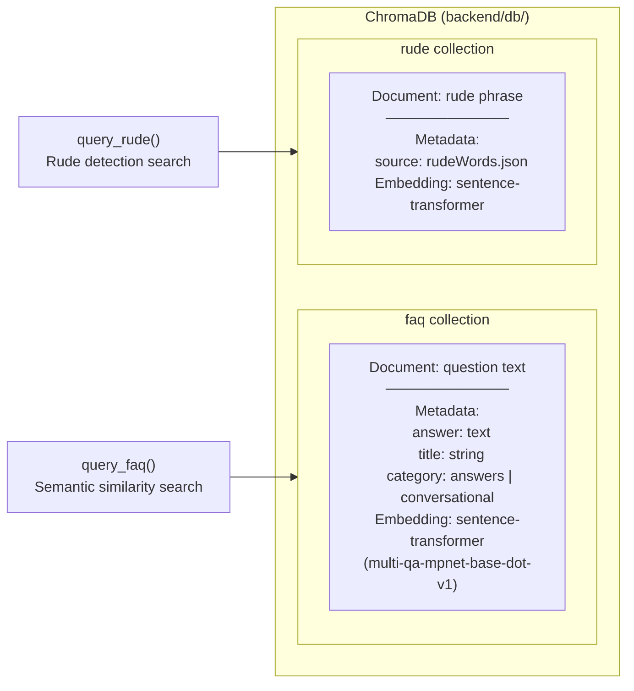
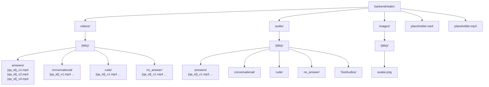
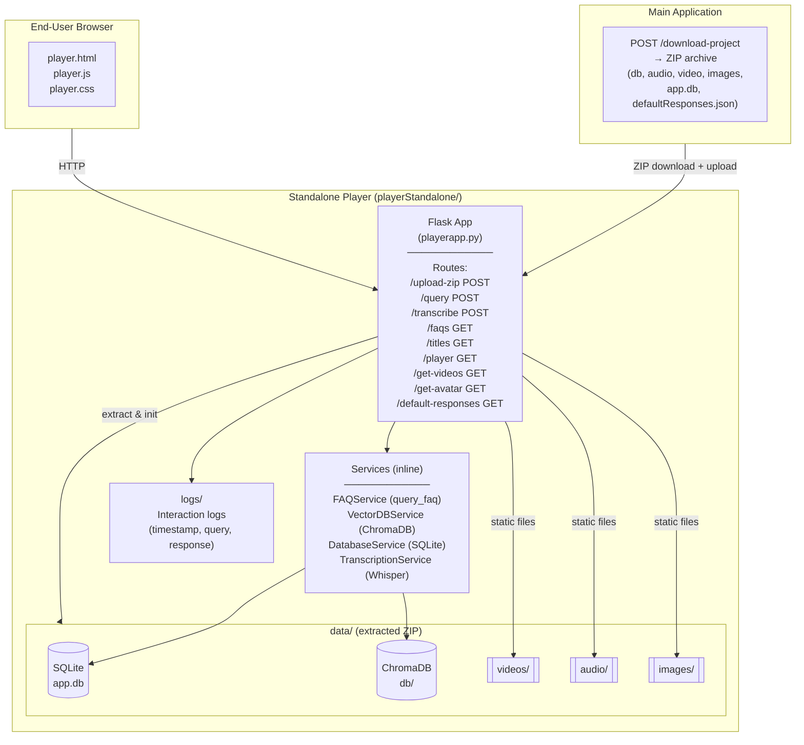
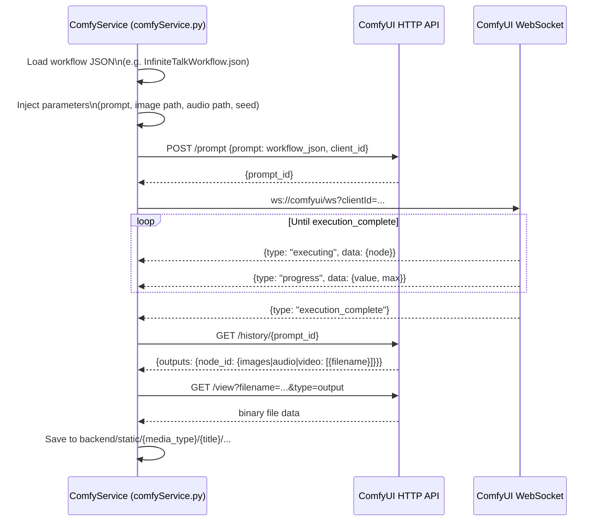

# FYPAvatar – Component Diagrams

This document contains component diagrams for the **FYPAvatar** system – an AI-driven talking-head avatar chatbot platform built with Python Flask, ChromaDB, SQLite, and ComfyUI.

---

## 1. High-Level System Architecture

Shows the major subsystems and how they relate to each other at the deployment level.

---

## 2. Backend Component Diagram

Detailed view of the Flask application and its service dependencies.

---

## 3. Frontend Component Diagram

Shows how the HTML/CSS/JavaScript pages are structured and their API interactions.

```mermaid
graph TB
    subgraph Pages["Frontend Pages (web/)"]
        direction TB
        CreatePage["CreateQA Page\ncreateQA.html + createQA.css\ncreatQAjs.js (1936 lines)\n────────────\n• Upload FAQ CSV\n• Generate avatar image\n• Generate audio/video\n• Track job progress\n• Multi-variant support"]

        EditPage["EditQA Page\neditQA.html + editQA.css\neditQA.js (1296 lines)\n────────────\n• Edit Q&A pairs\n• Replace audio/video\n• Delete FAQs"]

        TestPage["TestQA Page\ntestQA.html + testQA.css\ntestQA.js (357 lines)\n────────────\n• Test avatar responses\n• Text/voice query input\n• View matched answer"]

        PlayerPage["Player Page\nplayer.html + player.css\nplayer.js (630 lines)\n────────────\n• Interactive chatbot UI\n• Text + microphone input\n• Video/audio playback\n• Topic selector\n• Chat log display"]

        DashPage["Dashboard\nmain.html + main.css\n────────────\n• Admin overview\n• Topic management"]
    end

    subgraph API["Flask API Endpoints"]
        UploadAPI["/upload POST"]
        FAQsAPI["/faqs GET"]
        FAQEditAPI["/faq-answer POST/PUT/DELETE"]
        QueryAPI["/query POST"]
        TitlesAPI["/titles GET"]
        ImgAPI["/generateImage POST"]
        AudioAPI["/generate-audio-single POST\n/generate-audio-test POST"]
        VideoAPI["/generate-video-single POST\n/generate-video-extended POST"]
        TranscribeAPI["/transcribe POST"]
        ProgressAPI["/progress/:job_id GET"]
        MediaAPI["/get-videos GET\n/get-avatar GET\n/get-missing-media GET"]
        ExportAPI["/download-project GET"]
        SeedAPI["/seed-rude POST\n/load-conversational POST"]
        DefaultAPI["/default-responses GET"]
    end

    CreatePage --> UploadAPI
    CreatePage --> ImgAPI
    CreatePage --> AudioAPI
    CreatePage --> VideoAPI
    CreatePage --> ProgressAPI
    CreatePage --> MediaAPI
    CreatePage --> SeedAPI

    EditPage --> FAQsAPI
    EditPage --> FAQEditAPI
    EditPage --> AudioAPI
    EditPage --> VideoAPI
    EditPage --> ProgressAPI
    EditPage --> MediaAPI

    TestPage --> QueryAPI
    TestPage --> TranscribeAPI
    TestPage --> TitlesAPI
    TestPage --> AudioAPI

    PlayerPage --> QueryAPI
    PlayerPage --> TranscribeAPI
    PlayerPage --> TitlesAPI
    PlayerPage --> MediaAPI
    PlayerPage --> DefaultAPI

    DashPage --> TitlesAPI
    DashPage --> ExportAPI
```

---

## 4. FAQ Creation Data Flow

Sequence of events when a user creates a new FAQ topic with generated avatar media.

---

## 5. Query & Response Data Flow

How a user question is processed and an avatar video response is served.

---

## 6. Database Schema Diagram

Entity-relationship view of the SQLite and ChromaDB stores.

### ChromaDB Collections

---

## 7. Static Assets Organisation

---

## 8. Standalone Player Architecture

The standalone player is a self-contained deployment that receives a ZIP export from the main application.

---

## 9. ComfyUI Workflow Integration

How the backend communicates with ComfyUI to run AI generation pipelines.

### ComfyUI Workflow Summary

| Workflow File | Purpose | Outputs |
|---|---|---|
| `zTurboImageGen.json` | Avatar image generation from text prompt | PNG image |
| `IndexTTS-2.json` | Text-to-speech synthesis | MP3 audio |
| `InfiniteTalkWorkflow.json` | Basic talking-head video (image + audio) | MP4 video |
| `InfiniteTalkFlowNEWExtend2Chunk.json` | Extended talking-head (2 chunks) | MP4 video |
| `InfiniteTalkFlowNEWExtend3Chunk.json` | Extended talking-head (3 chunks) | MP4 video |
| `InfiniteTalkFlowNEWExtendFull.json` | Full extended talking-head | MP4 video |
| `hunyanVideoGen.json` | Hunyuan video generation | MP4 video |

---

## 10. Component Responsibility Summary

| Component | Technology | Responsibility |
|---|---|---|
| **app.py** | Python / Flask | REST API routing, async job tracking, static file serving |
| **FAQService** | Python | FAQ CRUD, semantic query orchestration, rude detection |
| **DatabaseService** | Python / SQLite | Relational data persistence (topics, Q&A, videos) |
| **VectorDBService** | Python / ChromaDB | Semantic vector search, embedding management |
| **ComfyService** | Python / HTTP / WebSocket | AI media generation (image, audio, video) via ComfyUI |
| **TranscriptionService** | Python / Faster Whisper | Speech-to-text conversion |
| **createQAjs.js** | Vanilla JS | FAQ creation UI, generation progress tracking |
| **editQA.js** | Vanilla JS | FAQ editing UI, media replacement |
| **player.js** | Vanilla JS | Interactive chatbot UI, video playback, microphone input |
| **testQA.js** | Vanilla JS | FAQ query testing interface |
| **playerapp.py** | Python / Flask | Self-contained standalone player backend |
| **ComfyUI** | External service | Node-based AI pipeline execution (image/audio/video gen) |
| **ChromaDB** | Embedded DB | Vector similarity search for FAQ and rude detection |
| **SQLite** | Embedded DB | Structured data storage for topics, Q&A pairs, video refs |
| **Faster Whisper** | Local ML model | Offline speech-to-text transcription |
