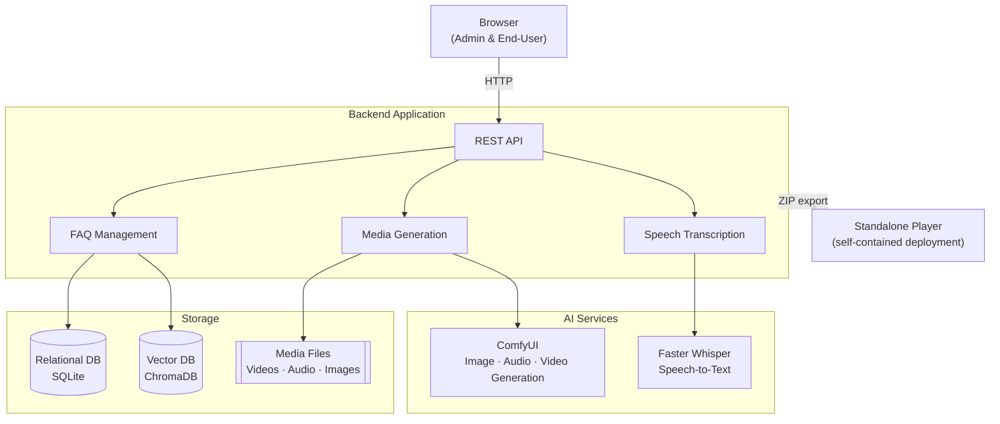
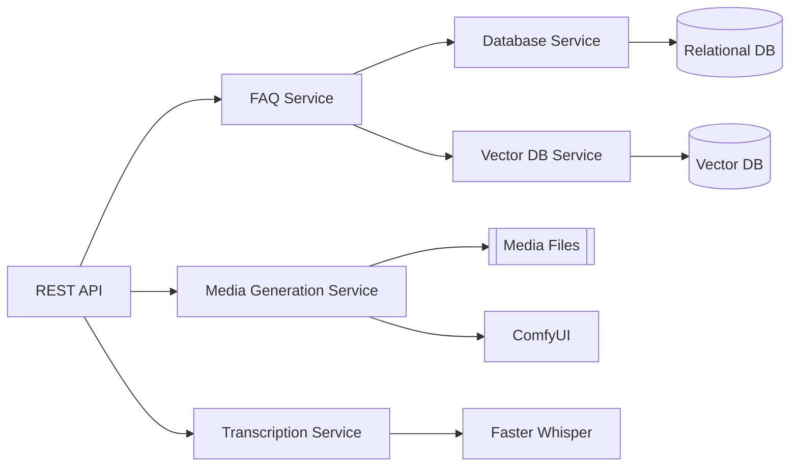
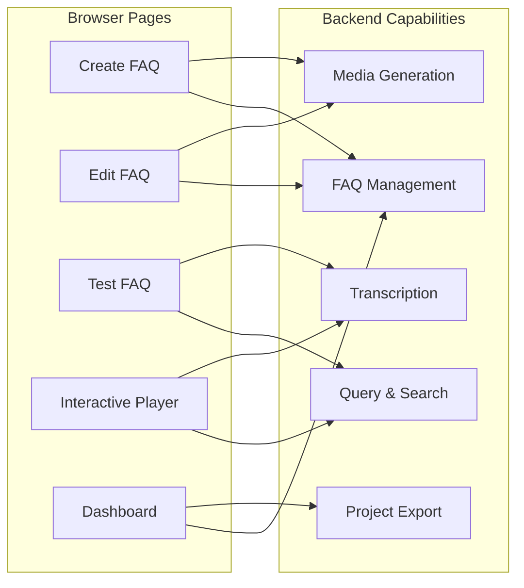
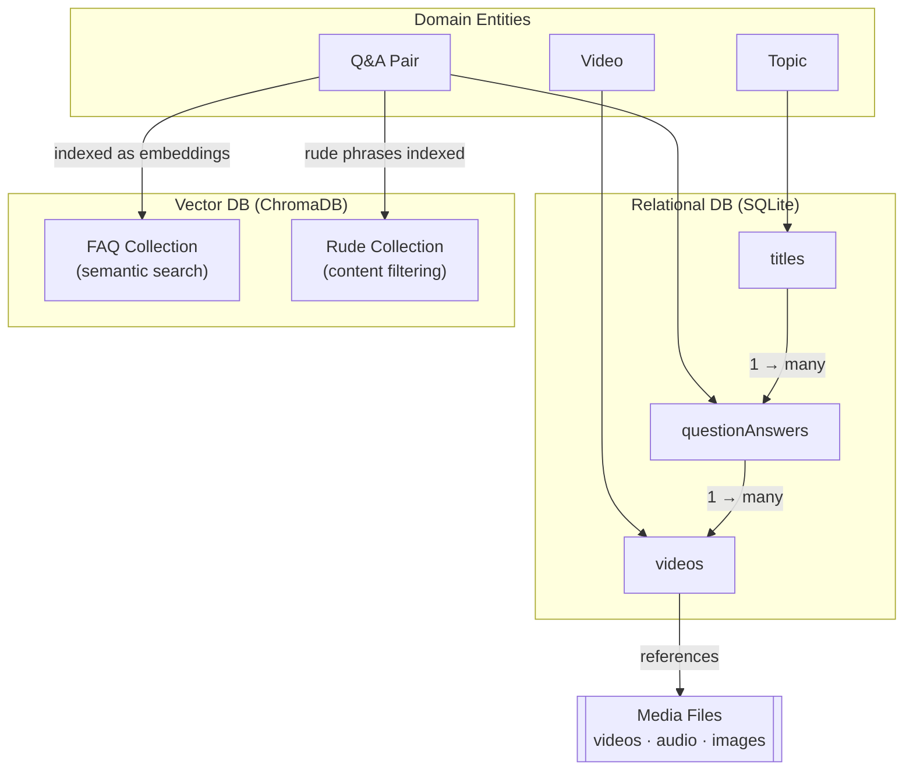
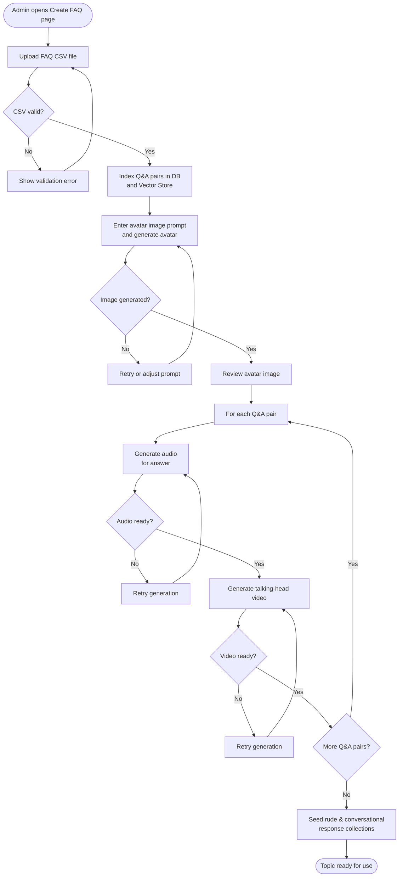
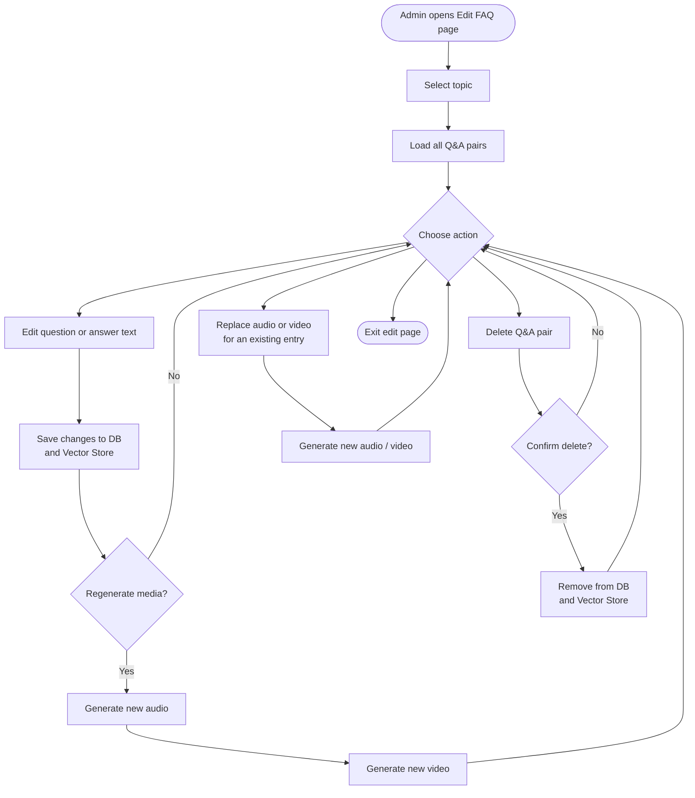
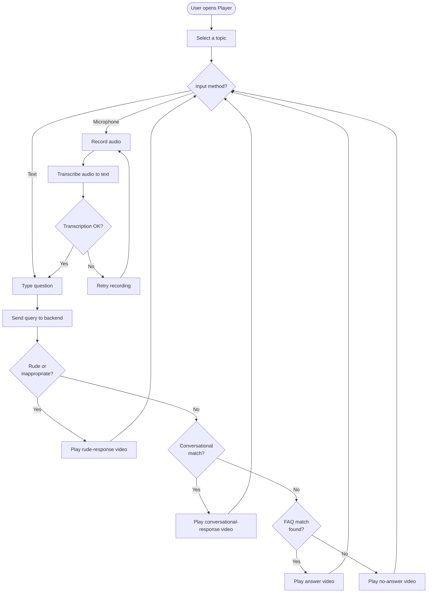
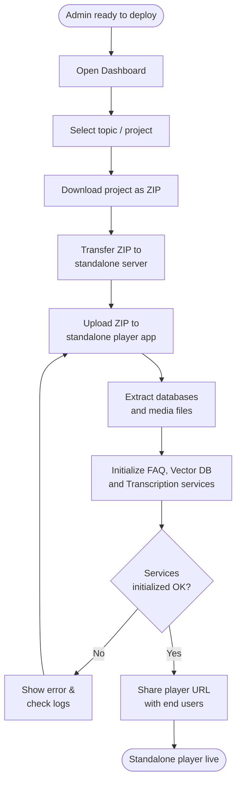

# FYPAvatar – Component Diagrams & Activity Diagrams

This document provides an overview of the **FYPAvatar** system architecture and key user flows. FYPAvatar is an AI-driven talking-head avatar chatbot platform that lets administrators build a knowledge base and deploy an interactive avatar that answers questions with generated speech and video.

---

## Component Diagrams

### 1. System Overview

The system is divided into four top-level areas: the admin/user browser, the backend application, external AI services, and an optional standalone deployment.

---

### 2. Backend Component Relationships

Shows how the five backend services relate to each other and to the data stores.

---

### 3. Frontend Component Relationships

Shows which browser pages interact with which backend capability groups.

---

### 4. Data Storage Relationships

Shows how the two databases and the media file store relate to each other and to the key domain entities.

---

## Activity Diagrams

### 5. User Flow: Create FAQ Topic

Covers the end-to-end journey an admin takes to set up a new topic, generate an avatar, and produce media for each Q&A pair.

---

### 6. User Flow: Edit FAQ Content

Covers how an admin modifies existing Q&A pairs, replaces media, or removes entries.

---

### 7. User Flow: Ask a Question (Interactive Player)

Covers the end-to-end journey of an end-user interacting with the avatar player.

---

### 8. User Flow: Export & Deploy Standalone Player

Covers how an admin exports a completed project and deploys it as a self-contained player.

